# Xintra's Abu Jibal Oil Company Lab Walkthrough

Writing up a walkthrough to figuring out the incident at XINTRA's Abu Jibal Oil Company Lab.   This lab is an emulation of the threat actor, Helix Kitten (APT34), conducting a multi-stage intrusion against an oil and gas enterprise based out of the Middle East. 

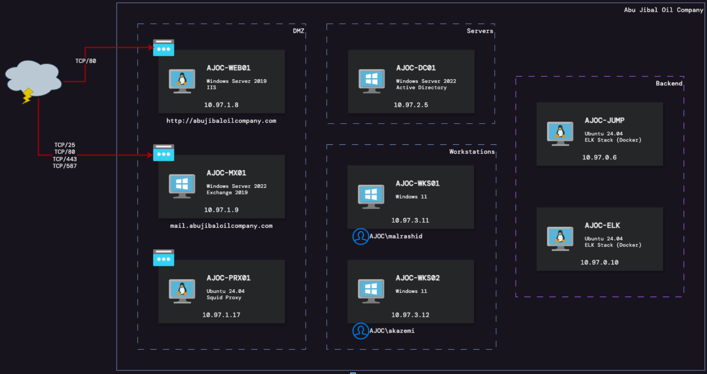

## Section 1: Understanding the network
It's a relatively "easy-to-understand" network, but choosing to look into each of the zones individually and see what/where things might possibly exist. 

### 1a. The DMZ
First section of the network to grasp first: the DMZ. 

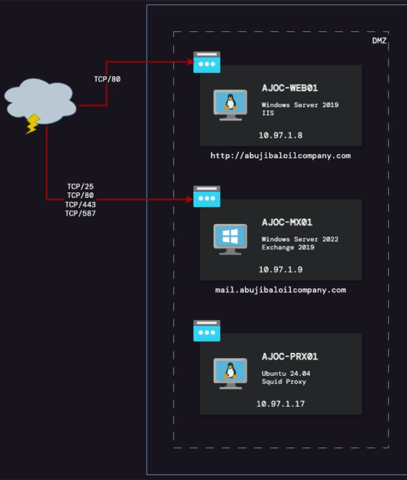

As the DMZ is the intermediate link between AJOC's intranet and the external internet, the servers seen here makes a lot of sense. AJOC-WEB01, a Windows Server 2019 IIS (10.97.1.8) that hosts the company's website as shown: `http://abujibaloilcompany.com`. Chances are, being a private entity like any other, it would be publishing announcements about their business, collaborations, and have a "Contact Us" page with emails. It's publicly exposed on port 80 to handle HTTP traffic into the web server. 

Together with that, AJOC-MX01 (10.97.1.9), a Windows Server 2022 that is configured to have the Exchange 2019 software in it: it is configured to provide email, calendaring and collaboration services. Seeing the protocols and ports it is exposed to, they can roughly be broken into:

| Port | Protocol | Purpose                                                                 |
|------|----------|-------------------------------------------------------------------------|
| 25   | SMTP     | Mail transfer between servers (server-to-server email relay)            |
| 587  | SMTP     | Authenticated mail submission by clients (outbound mail from users)     |
| 80   | HTTP     | Outlook Web Access (OWA), Autodiscover, and mobile device connections   |
| 443  | HTTPS    | Secure OWA, ActiveSync, and Outlook Anywhere client connections         |

And finally, the Squid Proxy Server: AJOC-PRX01. Roughly it can have a few purposes:

1. Outbound Traffic: Proxy making requests on behalf of internal users who want to connect to the internet. Hides internal IPs from the outside world, filtering to block access to malicious sites. 

2. Inbound Traffic: For instance, website visitors connect to the proxy directly instead of hitting the mail/web servers directly. It can forward valid requests internally to the right server. 

3. And seen from real life instances: Proxy servers also play a role in websites or external links that are associated with company policies. Certain sites, would not be accessible on the corporate network. Potentially, admins of the server might be accessing it. 

However, when we look at the diagram again: it is not connecting to the internet with any ports or protocols. _Possibly_, it's not yet exposed to the internet? But we'll explore that later, in the lab's evidence and logs put together. 

### 1b. The Workstations

Next up, the workstations of the staff at this office. 

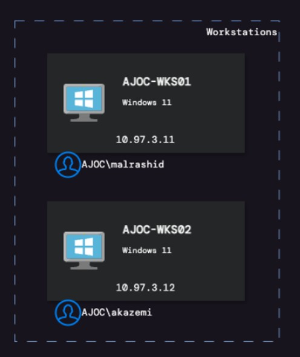

So far, we can see two active workstations in the office, that are tagged with an AD ID and are connected to the AJOC domain. They're AJOC-WKS01 (10.97.3.11) with malrashid as a user, and AJOC-WKS02 (10.97.3.12) with akazemi as the user in the other. 

Based off the scoping note, these devices have not yet been identified as the first initial method of entry into AJOC based off APT34's TTPs. 

### 1c. The Servers

Following that, the server that is part of the AJOC network. 

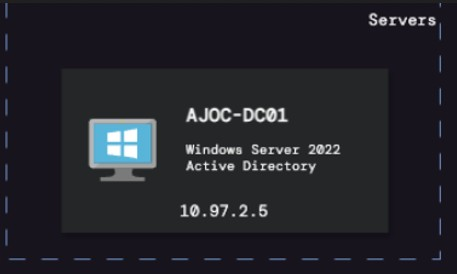

Here, we see a Domain Controller (AJOC-DC01) alone.  

Like other labs, the Domain Controller (AJOC-DC01) will be responsible for the workstations to authenticate with the Domain Controller, and look after respective user logins, enforce group policies the employees' user accounts will need to align with. 

### 1d. Backend section of the network

Lastly, the backend section of the network. 

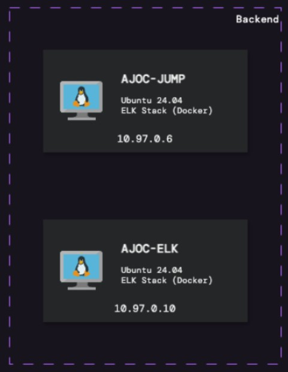

It comprises of a Jump Host and an ELK server. The previous time a Jump Host was seen is in the Waifu University case study, and more recently, in the Council of TA Lab. AJOC-JUMP is meant to act as a controlled entry point into the backend network for admins. As it does not need to be exposed into the internet, it's fully alright to have it part of the Backend portion of the network. 
However, we can also see an ELK Stack (Docker) inside the Jumphost too. Something to think about: as this server could have more than one purpose: 

i. As a secure access point to the backend/internal network. </li>

ii. As a log collector or analyzer, likely to collect logs from other machines or support incident investigation. </li>

iii. Possibly used by analysts/admins to access ELK data without touching the ELK server directly. </li>

The AJOC-ELK server would be collecting logs from the components thus far, and would not need to be exposed to the internet. 

And with that, onward to solving the lab! 

## Section 2: Lab Walkthrough

### Section 2a: Cracking the Perimeter  

As per the scoping notes, and the background threat intelligence reports about APT34, it is hinted that they are known for utilising webshells often. Therefore, the targetted machines for webshells are typically Web Servers. In the case of Abu Jibal OC, it's likely AJOC-WEB01. After opting to spend a bit more time within the folders, there was an interesting file that was present in the "C:\Deployments\AbuJibalOilCompany\uploads" path. The file was called `app.aspx`.

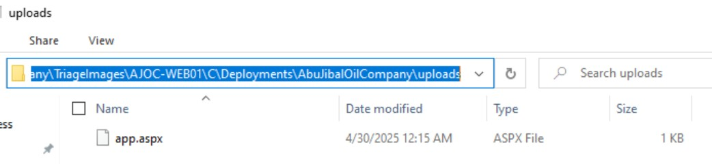

When looking up other events involving the webshell, inside the EvtxECmd file, we can see another variation of app.aspx in the logs. It has another form of extension, indicating it had been compiled successfully. 

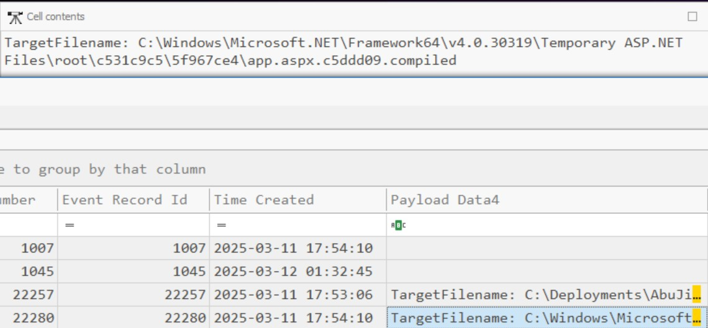

It also helped to take note of the actual timestamp of the webshell compilation. It took place at around 11th March 2025, at 17:54:10. Pivoting into the ELK logs that have IIS logs recorded, the next thing to do was to find if any successful connections were made by the webshell after that timestamp, and see its User-String. 

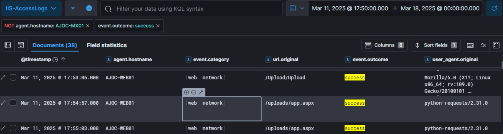

When looking across the logs, it is possible to see successful requests made by the webshell after that timestamp. Correspondingly, its User-Agent strings are of the value `python-requests/2.31.0`. It is a bit of a suspicious User-Agent string to use as real users almost never access websites using Python clients. Typically, interactions with real users would make use of long, complex User-Strings that mimic actual browsers.  

When inspecting the actual content of the app.aspx file, we can see some routine occurring in the first half of the code.  

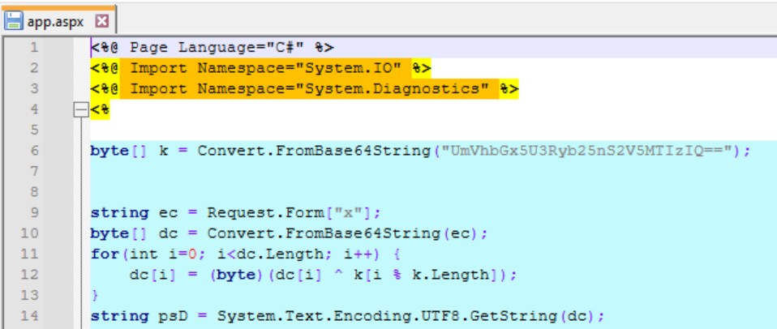

In the first line, a Base64 string is decoded into a byte array with the variable name, 'k'. The decoding of the string from the app.aspx script reveals a plain string of value `ReallyStrongKey123!`. 

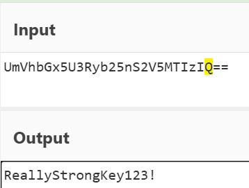

Following that, 'ec', is a string value of some HTTP form parameter named "x".  

Another byte array, called 'dc' this time, is made by converting the 'ec'-named string from the HTTP form parameter. After that, a byte-wise XOR operation takes place between the first byte array 'k' and the second byte array 'dc'. The array 'k' is repeated until 'dc' is byte wise XOR-ed with it fully.  

The final variable, psD, is the resultant UTF-8 string that is created from the XOR-processed bytes.  

At this point, there's a clearer understanding of the purpose of the webshell and some of its attributes. We won't yet inspect the entire code that's inside `app.aspx`, but will revisit it as required. 

Onwards to the next section of the lab!  

### Section 2b: Sniffing Secrets  
The lab has been specific in sharing that on March 13, 2025, a software called Rubeus was executed on the web-server (AJOC-WEB01). When looking up what Rubeus does, a [small write-up from MITRE](https://share.google/oBZ93KqDuwPhbKV7p) and [another from JumpCloud](https://jumpcloud.com/it-index/what-is-rubeus) confirms it is a tool that has been specifically built for Windows environments. Its purpose is for Kerberos credential manipulation and attack manipulation. It makes use of Common Language Runtime (CLR) to execute directly in memory, and reduce its footprint in the victim systems. Given that it is a command-line tool, the best resource to look into for Rubeus activity was ELK logs. 

Narrowing the view to just the 24 hours of March 13 2025, the host to strictly AJOC-WEB01 and looking up logs with rubeus involved, all Rubeus activity took place at around 8:07pm of the day. Based on the command line of the process, it's close to [this command in the github repo](https://github.com/GhostPack/Rubeus?tab=readme-ov-file#golden:~:text=requests%20and%20renewals%3A-,Retrieve%20a%20TGT%20based%20on%20a%20user%20password/hash%2C%20optionally%20saving,opsec%5D%20%5B/nopac%5D%20%5B/proxyurl%3Ahttps%3A//KDC_PROXY/kdcproxy%5D%20%5B/suppenctype%3ADES%7CRC4%7CAES128%7CAES256%5D,-Retrieve%20a%20TGT). The goal of this command is to request a Kerberos TGT for a user and to pass it to the current session, so that the TA can authenticate as the user `malrashid`. 

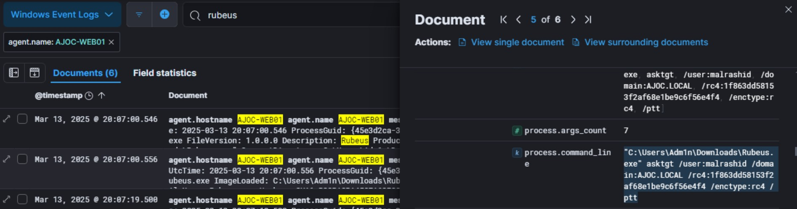

The 'asktgt' argument in Rubeus generates an Authentication Service Request to the Key Distribution Center for a TGT, and can be done using a user's password or hash. In the above case, an RC4 hash. The '/ptt' flag tells Rubeus to inject the received ticket into the current session, so that from point on, subsequent Kerberos-based requests in that session will assume the identity of 'malrashid'. The lab had also let us know that PowerShell was used to manipulate Exchange mailbox settings, likely to re-enable or regain control over a previously deactivated system account. To investigate this out, opted to look into the triage image of AJOC-MX01. From a previous lab, more specifically the Airbuzzed one, Powershell Transcripts get stored into the Documents folder of a user, each with its own date-timestamp.  

When navigating the users, not all had a Documents folder, so it made some things easier to filter out. Some other interesting activity took place with other users in other timestamps, but nothing specific revolving native PowerShell commands about the mailbox settings. Another place to find them are in the 'AppData\Roaming' directory branch.

And rightly so, it's been inside the user `HealthMailbox894d0aa`'s directory, in a file called 'ConsoleHost_history'. More specifically, in the path as shown below:  

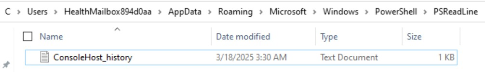

When looking into the file, these are the commands we can see:  

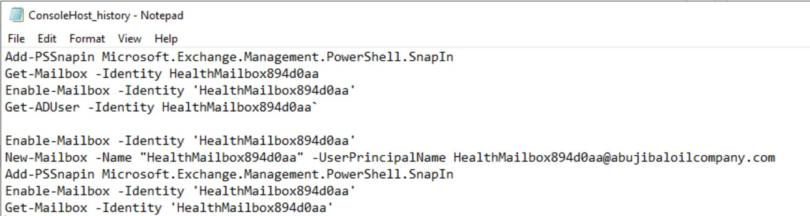

In a nutshell, the meaning of these commands are:
1. To load the Exchange-specific cmdlets 
2. Retrieve the mailbox object for the user with the identity HealthMailbox894d0aa
3. Connect an existing Active Directory user account to a new mailbox, and retrieve the AD user object with the username. 

And these commands get repeated about. What's interesting about the ConsoleHost_history file in that AppData path from above is that, it's not specific by datestamps, unlike the ones that are part of the Documents folder. What we see in the file that sits in the PSReadLine directory, is the record of every PowerShell command done in that machine. PSReadLine starts recording the commands typed in a PowerShell session, and after it is closed, it appends all those commands to the end of the ConsoleHost_history.txt file. Another session, if it were opened the following hour, day, or week, will continue to get appended here. Thus, it is a great way to find out, as an indiscriminate big picture, all PowerShell commands conducted as the user, when one is not yet keen to see his day-by-day activity yet. It also goes a long way in finding out what the threat actor chose to conduct once they had compromised a machine, and there's a good chance, due to the repetition of some commands, they might have repeated the process on another day. 

From the PowerShell commands' history, we can see that the TA is keen to spin up a mailbox again as the `HealthMailbox894d0aa` user. Therefore, it made sense to look into the ELK logs that were revolving around this userID. Sure enough, we see the commands from the ConsoleHost_history file being recorded at their times of execution. 

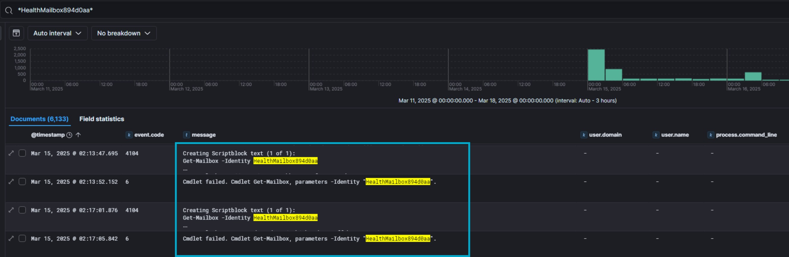

Prior to that, there was even a password reset on that same Healthbox system account, and changed its value to a new one. This was done under the guise of the user account `knajjar`.

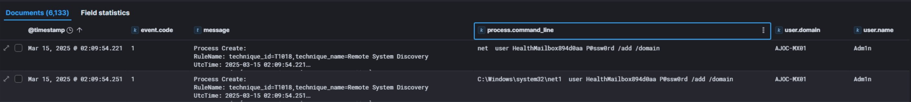

Lastly, for this section, the lab hinted at using password filters to extract credentials, and configuring a custom network provider. So far, any activity we've seen in alterting passwords come under the `ajoc\knajjar` domain and username respectively. Chances are, the TA would possibly continue to do all the password activity he would like to under the same guise. 

To check if this might be a potential route: opted to alter the ELK view from the time the TA changed the HealthMailbox password, from March 15 2025, 02:09:54 to March 16 2025 midnight (to just check for the day), filtering the user.domain to `ajoc`, user.name to `knajjar` and possibly checking if there were process.command_line arguments visible for this activity to extract credentials. 

More potential hits happened after extending the view to March 17 2025, midnight. One event that confirms the intention to use password filters was the presence of psgfilter.dll, and the command to set it into a system and as a hidden file. 

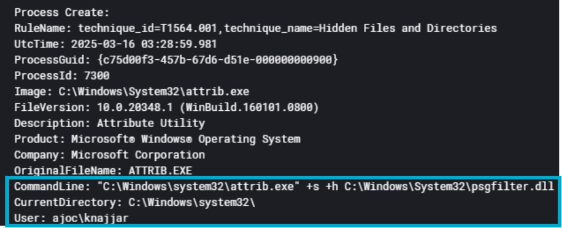

In addition, there is a write-up of the same TA who did indeed use [this same DLL for extracting out passwords](https://provintell.com/2024/10/16/oilrig-exploits-windows-kernal-flaw-in-cyber-espionage/). As it is not a Windows component, it is a suspicious file with a certain activity to look out for. 

Next, the lab indicates that a custom network provider was configured as a credential-stealing technique, and its name is NPPSpy. The goal is to find the DLL file that was registered as the provider path, and amongst the logs found revolving 'NPPSpy' in the timeframe, the event that reflects that is a registry-value setting event.
Therefore, the DLL in question is `WinServices.dll`. 

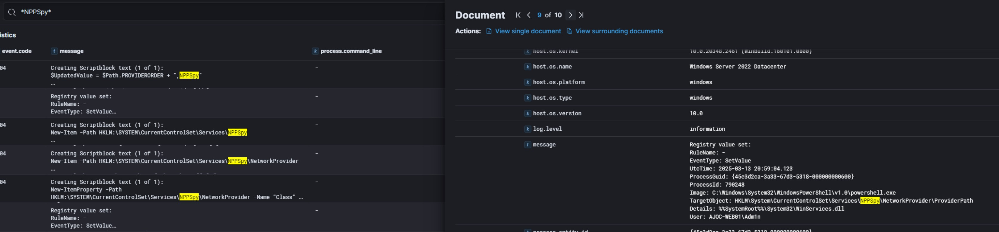

So far, we've found out the ways the threat actor entered the system, and the techniques they've deployed for getting their hands on more credentials. Let's see from here on what they intend to do with what they've gotten so far. 

### Section 2c: Authentication Hijack
At this point, the threat actor still shows a high interest in getting the servers under their control. It's also made known that a malicious PowerShell script was pulled from their C2 server and into the domain controller server. When vetting through the relevant Proxy Server logs, we can narrow down the name of the script to `installer.ps1`, being downloaded from the TA's 'maskdesk.info' domain. 

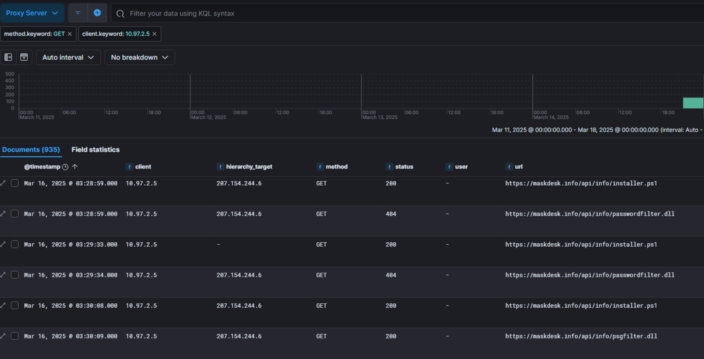

Alongside the script, there are also attempted downloads of the 'passwordfilter.dll' - note that theit status were 404, and the successful DLL that ultimately was downloaded is 'psgfilter.dll'. Looking closely at the log, this `psgfilter.dll` was successfully downloaded onto the Domain Controller on March 16th 2025, at 03:30:09am. 

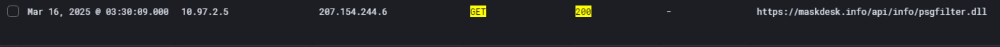

With this as a pivot, it therefore made sense to look into all the logs associated with `psgfilter.dll` in the Windows Event Logs. Sure enough, we do see some properties in the registry getting set with the `psgfilter` value. 

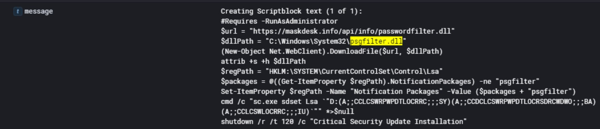

After setting a URL variable, and a target local path to where the downloaded DLL will be saved, the actual psgfilter.dll file gets downloaded from the URL and writes it `C:\Windows\System32\psgfilter.dll`. The '+s' and '+h' flags set the downloaded DLL to a system file and hide it. 

Then, a regPath variable is defined, with the registry key path for Local Security Authority settings. At the packages variable, first, the `Notification Packages` registry value is read and ensure that the `psgfilter` value is not duplicated, and appends it to the list. Essentially, the goal is to make LSA load psgfilter.dll into its LSA process. 

The 2nd last line, ensures the LSA service and its objects are accessible in a way the Threat Actor might need, and lastly, a restart is scheduled in 120 seconds with a reboot message "Critical Security Update Installation". That's how the threat actor ensures their custom, and deadly, DLL is loaded into the Domain Controller successfully. 

### Section 2d: Hijacking the House Keys
The answers to these questions are found in the same log we looked into the previous section. 

There are two DLLs that the threat actor tried to utilise, but only one was successful. That is `psgfilter.dll`. 

The server was configured to restart in 120 seconds (2 minutes), to ensure it's ready to be part of their credential dumping operation. 

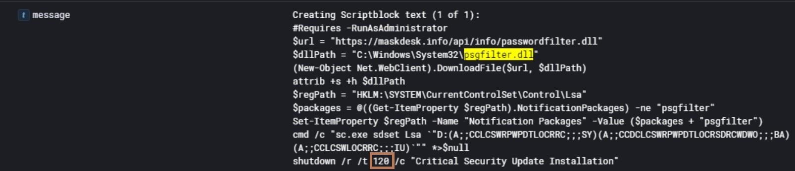

And finally, when modifying the registry value of the LSA settings, the recorded SID, is the following value in the log:

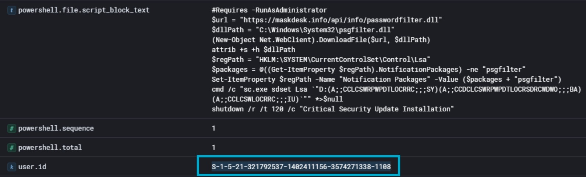

### Section 2e: Keylogger
To find the keylogger, I opted to look it up manually across the Triage images from all the devices. And there was an "odd-man-out" type of application sitting in the Documents folder of the Public user inside AJOC-WKS01. 

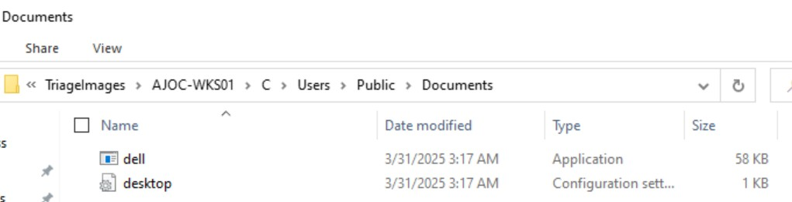

As from my previous attempt from the Council of Tropical Affairs Lab, I attempted to extract the dell.exe file out into its components. And after vetting through them all, a bit of visible results appeared in one of its `.rdata` file, like so. 

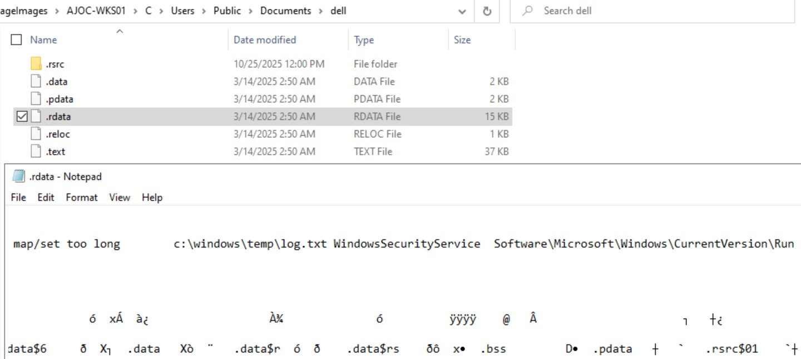

This was hard to confirm if it indeed had been where the keylogger was configured to store keystrokes, so I opted for another method to inspect the PE. That was through, strings. But the issue with strings is that, it will capture even the most smallest one of them all. In addition, for a hardcoded path, the TA does have a location in mind, and it has to start with a Disk Letter: like `X:\xy*` ~ minimally, 5 letters as a minimum length for the string can be pulled out as less bloated results. To do this, I introduced the `-n` flag when conducting the command, and ensuring only strings 5 characters and above are paid attention to, and piped them into a text file with the `>` character in the end. 

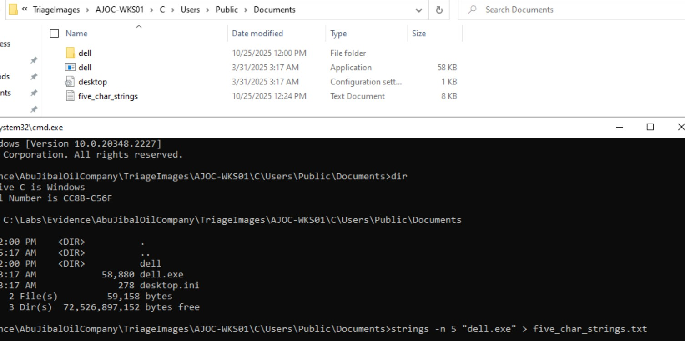

Opening the text file, we can see some very interesting collection of strings: and one of them, matches the potential path indicated in the `.rdata` file from above. 

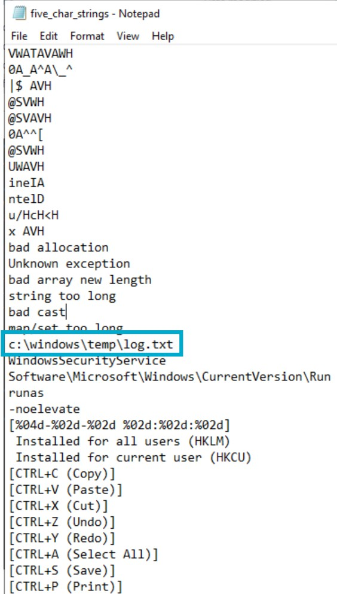

As this was discovered inside the AJOC-WKS01, there are more features related to it to find out as well. One of them, is its Import Hash (IMPHASH value). Typically, this is in the MD5 Algo. The tool, pestudio, helps decipher this out, as part of its footprints feature. 

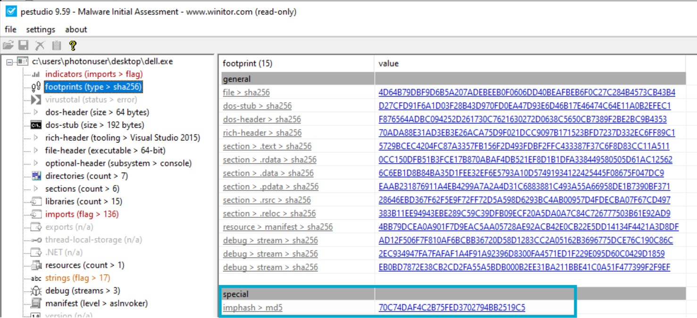

So, we know the TA has implanted in a keylogger, and has a hardcoded path they're keen to collect all it looks up at. Definitely, it's meant to go somewhere after it got collected inside the `log.txt` file in the path. To see more about its route out of the system, a potential way to check is the logs of the AJOC-MX01 server. As the lab shares that some data did successfully go out via email, then from the ELK fields available, the recipient-address must truly exist and have a value. It got sent to a proton mail address, as seen from the logs. This roughly happened in Mar 16 2025, at 03:12:04 to 03:58:38am or so.  

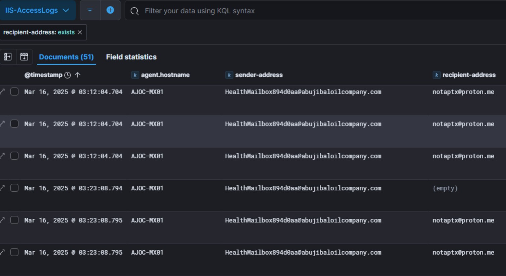

Here, we can see that the sender address has been the HealthMailbox* address, as seen previously from the Sniffing Secrets portion of the lab. 

### Section 2f: Security on Snooze 
After uncovering this much, it is odd to consider how the Threat Actor managed to come this far without any of the defense mechanisms in AJOC's system being alerted. Given how the AJOC network is primarily Windows, one place to pivot into would be the events associated with Windows Defender in the ELK logs. 

To check the appropriate event code for events related to Microsoft Defender, this [list of codes](https://learn.microsoft.com/en-us/defender-endpoint/troubleshoot-microsoft-defender-antivirus#event-id-5001) showed that the 5001 value might be the most relevant if the MS Defender has been tampered with. 

Therefore, after filtering the logs of the entire incident to `event.id == 5001`, we get three specific events. 

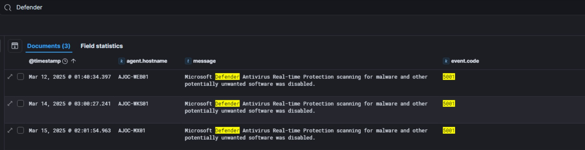

The first device where Defender was disabled was on WEB01, on March 12th 2025, 01:40:34am. Followed by WKS01, on March 14th 2025, 03:00:27am. The last device was MX01, on March 15th 2025, 02:01:54am. 

With these events found so far, let's create a small chronological view of what has happened so far. 

| Time Stamp    | Activity |
| ----------- | ----------- |
| 11th March 2025, 17:54:10 | Webshell Compilation on AJOC-WEB01 |
| 12th March 2025, 01:40:34 | MS Defender on AJOC-WEB01 is disabled |
| 14th March 2025, 03:00:27 | MS Defender on AJOC-WKS01 is disabled |
| 15th March 2025, 02:01:54 | MS Defender on AJOC-MX01 is disabled |
| 15th March 2025, 02:09:54am | Password reset for HealthMailbox account disguised as 'knajjar' in Domain Controller |
| 16th March 2025, 03:28:59am | `installer.ps1` being downloaded from TA's maskdesk.info domain |
| 16th March 2025, 03:12:04 - 03:58:38 am  | sending emails to the APT address  |
| 16th March 2025, 03:30:09am   | custom DLL, psgfilter.dll downloaded onto the Domain Controller  |

### Section 2g: Reconnaissance 
The lab then proceeds to hint that under the guise of 'malrashid' - the AD username associated with AJOC-WKS01, there was some suspicious activity involving a PowerShell script from GitHub inside MX01. 

Looking into the Documents Folder of AJOC-MX01, we can see a PowerShell Script that creates a WebClient object and to download a script from github. 

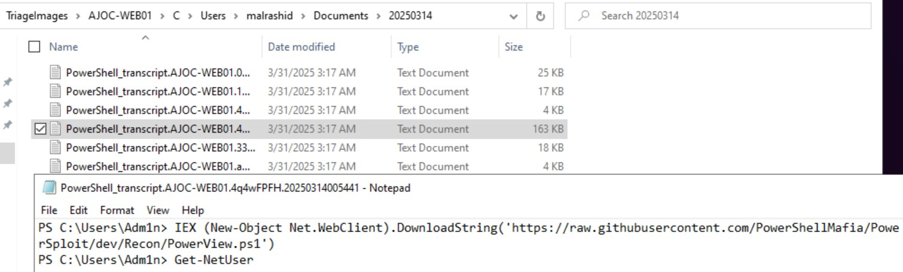

This occurs at roughly 14th March 2025, at 00:54:41am. Afterwards, in another script that was run not too long after, another powershell script is downloaded from Github. 

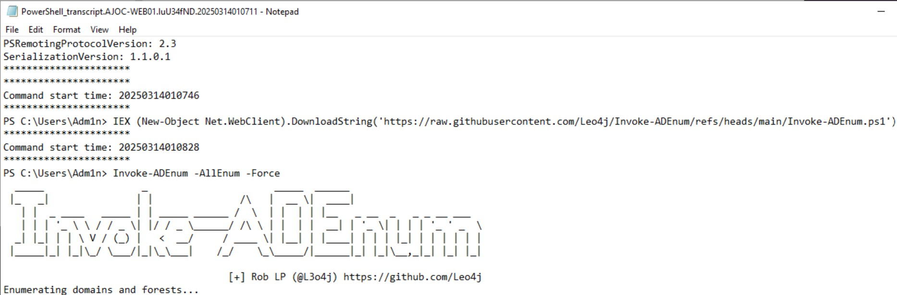

When scrolling through the entire transcript captured in this file, this `Invoke-ADEnum.ps1` file is the Powershell script to enumerate Active Directory.  To double check that these commands were run, the next location to check if these scripts were run is in the PSReadLine artifact. Navigating to the `AppData\Roaming\Microsoft\Windows\PowerShell\PSReadLine directory`, we can see the same WebClient lines with the same Github links visible in the artifact. 

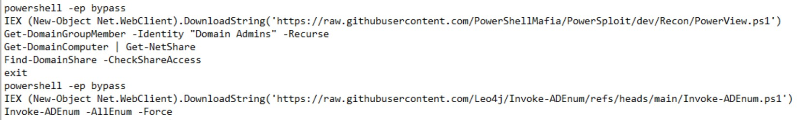

Scrolling through the commands that were collected in the artifact, we can also see another command to enumerate systems where they had local administrator access. 

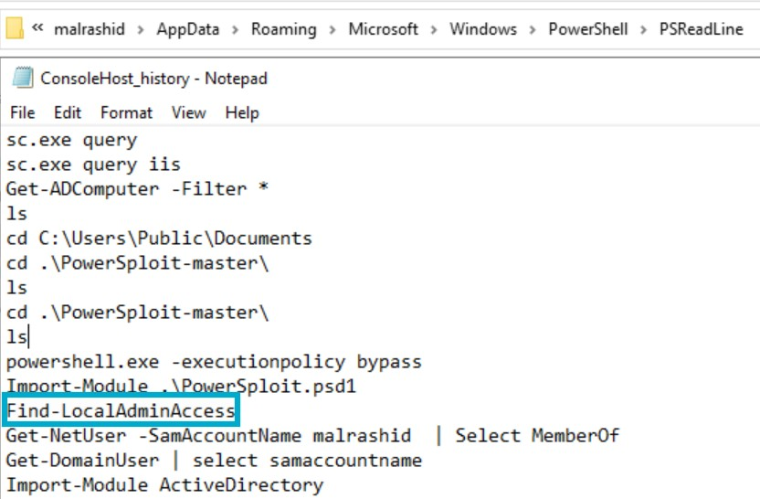

And that concludes this section of Reconnaissance. 

### Section 2h: Abusing the Exchange Server
This part of the lab focuses more into Email Exchange Server, AJOC-MX01. It turns out, during a specific time frame, on March 15th 2025, between 02:10am to 02:12am UTC, a threat actor attempted to add a compromised account to a high privilege Security Group. So far, the account that has been used thus far is the 'HealthMailbox894d0aa' account. With this account, a password change happened in the Domain Controller, and it was as this email address, that emails were sent out to the threat actor's email address. 

Therefore, it would make sense to look out for logs that mention more things happening to `HealthMailbox894d0aa`. Filtering the logs to that timeframe indicated, and ensuring the process.command_line field exists, some promising results began to appear. 

It indicates that there is an intention to add the `HealthMailbox894d0aa` account to the Exchange Windows Permissions group. The first attempt to add it into the group happens at 02:10:40:990 timemark. However, the true timemark at which it happens is 02:12:02:199. 

Let's compare both the commands to see why:
| Timemark    | Command |
| ----------- | ----------- |
| 02:10:40:990 | net localgroup "Exchange Windows Permissions" HealthMailbox894d0aa /add |
| 02:12:02:199 | net group "Exchange Windows Permissions" HealthMailbox894d0aa /add /domain |

The first command adds the user HealthMailbox894d0aa to the domain group Exchange Windows Permissions. Requires that the group Exchange Windows Permissions exists in AD, not on the local machine.

The second command adds the user to a local group named Exchange Windows Permissions. The group must exist locally on that specific server. Therefore, it's in this second command that the HealthMailbox account was successfully added to the actual server itself. 

In addition, under that same account, when looking into the triage image of AJOC-MX01 and looking into the PSReadLine folder, there is activity of a Snapin being loaded into the system too. 

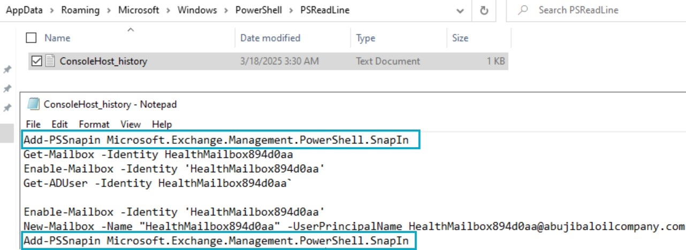

Likely, this is to ensure PowerShell has loaded an external binary extension that added extra cmdlets to the session.

That concludes this section on Abusing the Exchange Server

### Section 2i: Highway Through the Hosts
In this section of the lab, it had been specific enough to discuss about a tool the threat actor had used called 'Ngrok'. Here is an [article](https://www.trendmicro.com/en_us/research/24/j/earth-simnavaz-cyberattacks.html) of the same threat actor that speaks about their use of Ngrok. Here's an explainer of [Ngrok and why it can be abused due to its functionality](https://www.browserstack.com/guide/what-is-ngrok). 

As a result, the quickest way to find evidence of Ngrok was to look for any ngrok-associated ELK logs. At a glance, some interesting details are found. 

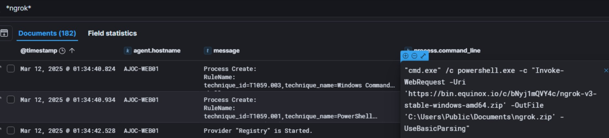

It first came into the AJOC-WEB01 server, and its zip file was downloaded from this 'equinox.io' domain and stored in the C:\Users\Public\Documents path of AJOC-WEB01. When looking further into the logs after its download, a few seconds later, there is a hint as to where this zipped Ngrok was extracted. 

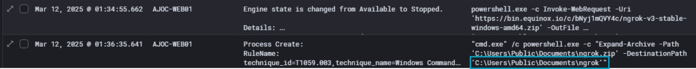

It shows that the file was not moved, and it remained at that same path from above to be extracted and used. When crosschecking the Triage image of AJOC-WEB01, we can see the evidence of the Ngrok folder in the path as shown from the logs. 

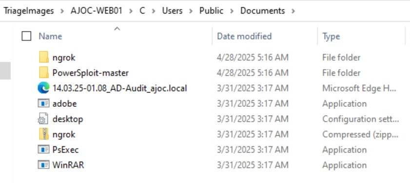

Within the extracted folder, there is one more thing associated with the threat actor that could be found: the authentication token to link their instance of the Ngrok agent to ensure it can reach back into the compromised Abu Jibal network. 

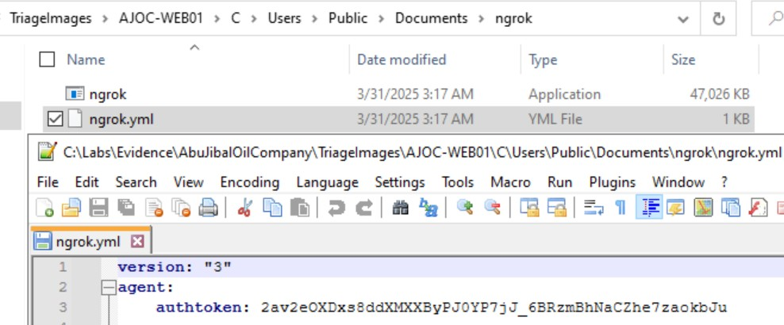

Continuing more into the logs, there is also a record of a scheduled task that involved ngrok once more. And it was disguised with the name of 'WinUpdate'. 

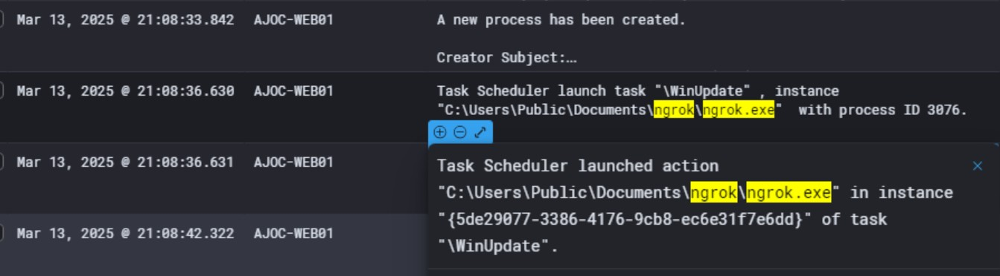

The follow-up to Ngrok is that there was installation of PsExec in the AJOC-WEB01 system too. When looking this up in the logs, there are some interesting movements of this file. 

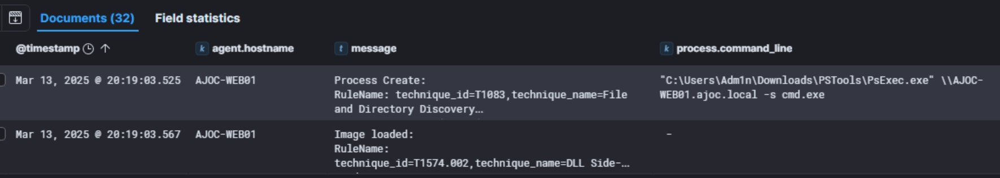

The first observed log of PsExec shows that it was initially in the Downloads folder of a user called `Adm1n` - even this username sounds very odd, and not that related to AJOC's employee's user IDs. Based on the observed logs, activity relating to PsExec took place the entire of March 13th 2025. Following that, it took place under the `malrashid` username for March 14th 2025. It too had the same command seen as the first log. 

The other interesting thing is that this PsExec file was also observed in the same folder of AJOC-WEB01 where Ngrok was found. 

While the logs hadn't explicitly shown a movement of this file into this folder *Ok, I don't know how to proceed with this. Will await for tmechen's or Renzon's words*

Onwards to the next section ~ the Sneaky JS Backdoor. 

### Section 2j: Sneaky JS Backdoor
Earlier, there was this `Adm1n` username that was just far too odd, and sticking out a bit like a sore thumb compared to the AJOC employee usernames observed so far. With this in mind, I opted to look up all the logs that were relating to it. 

Early on, there is a log that indicates a user account was added to the system, of that same name. 

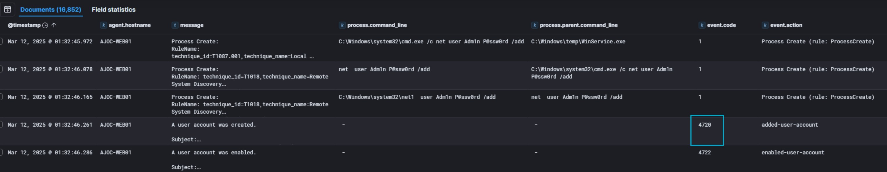

And interestingly, there is an associated event code for a newly added user account, 4720. As per that, let's inspect across the logs if more accounts were added alongside 'Adm1n'. 

A total of 5 logs were observed, and there is one extra username, that was not yet observed quite so actively thus far: `Adm1nistrator`. We'll see if more activity around this username gets observed in time.

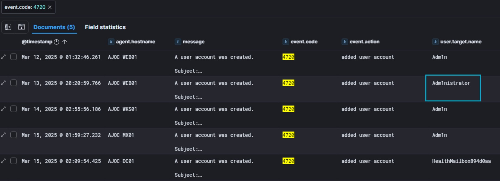

The lab then hints that one of the files of AJOC-MX01, `logon.aspx`, had some tampering done to it by the Threat Actor. To check when it was last modified, the best thing to do was to parse its $MFT file out, and inspect the MACB timestamps. 

After copying that MFT file into the Desktop, and parsing it with the Eric Zimmerman tool with this command: 

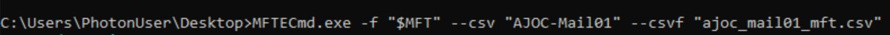

This was observed (after hiding a couple of columns):

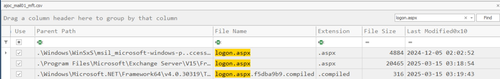

The second logon.aspx file's size is 4 times the first one's size and it was last modified on March 15th 2025, 03:18:54. Its path is also different compared to the first copy's, and might be visible in the Triage image of AJOC-MX01. The value in its Path cell is `.\Program Files\Microsoft\Exchange Server\V15\FrontEnd\HttpProxy\owa\auth`, and looking into this folder for logon.aspx, let's see what's visibly different. 

It's at the end of the file, there's this very odd function called 'x' present. 

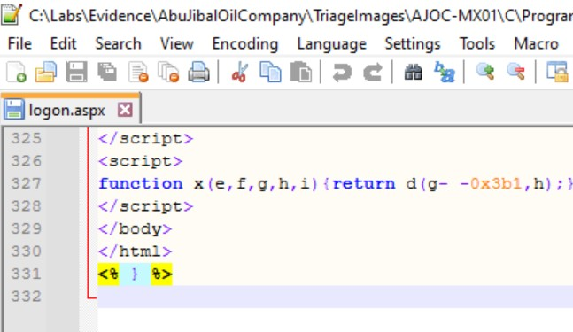

It's the code at line 327 of the script that's extremely long and complex. So briefly scrolling across it, it is at function c that is quite interesting to look at. 
After copying and pasting it in a new file, this is the rough look of the function. And it contains two very interesting lines of strings in its string array. 

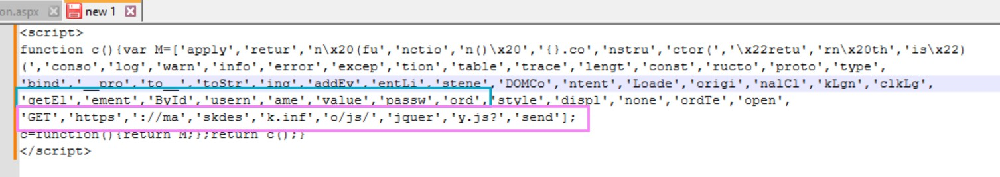

The one in blue mentions the HTML elements that mention username and password. Underneath that, the one in pink is about a HTTP GET request to a URL. When these mini strings are put together, it translates to `GET https://maskdesk.info/js/jquery.js?send`. This maskdesk.info domain was observed before in Section 2c, as the domain from which the installer.ps1 file was downloaded from. It's therefore, the domain the Threat Actor was making use of. 

So something is up: this logon.aspx file was modified to send out the username/password combos to maskdesk.info domain. There would be a bit of extra details about this to be found in the logs. From here, we will look into the IIS logs. 

Shortlisting a few of the columns of the logs, especially the source.ip column, an IP address that's of odd origin, appears quite frequently, relating to the logon.aspx file. 

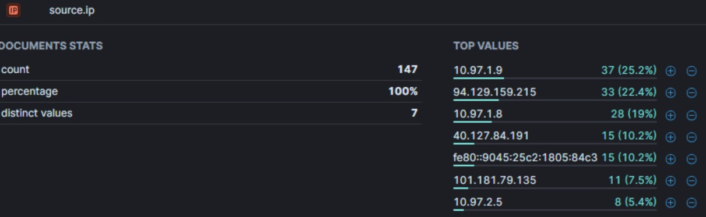

10.97.1.9 is an internal IP address, and is tied to AJOC-MX01. As per the stats, the `94.129.159.215` address is one that communicates with it the most after that, and touches the logon.aspx file, very close to the last modified time of that file discovered from the previous section ~ March 15th 2025, 03:18:54. The related user agent string for this activity is also indicated in the user_agent.original field: `Mozilla/5.0 (Windows NT 10.0; Win64; x64) AppleWebKit/537.36 (KHTML, like Gecko) Chrome/134.0.0.0 Safari/537.36 Edg/134.0.0.0`. 

And that concludes this section of the lab. 

### Section 2k: Climbing the Privilege Ladder
Thus far, it's with a high probability that we can confirm that the TA's domain from where they're pulling their tools is `https:\\maskdesk.info` and the folder where they're keeping tools they utilise so far (ngrok, psexec), is the `C:\Users\Public\Documents` folder in the AJOC-WEB01 server. Let's see if there's anything else to look into in that folder. 

The one in question now is this adobe package. Opting to do some static analysis on the executable, the quickest way to try was to use strings on the application. 

After running the command and piping the results into the txt file like so: 

This is what is visible in the resulting file. As seen from the previous [article](https://www.trendmicro.com/en_us/research/24/j/earth-simnavaz-cyberattacks.html), it hints at the CVE being exploited with a program database (PDB) string. That too, is visible in the strings result of adobe.exe. 

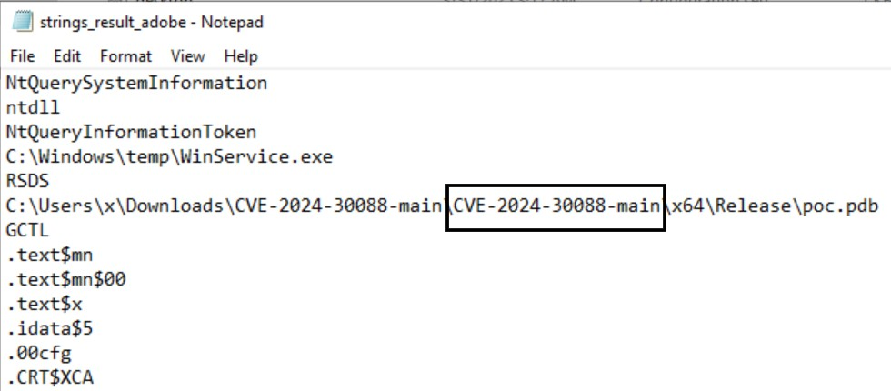

Onwards to the final section! 

### Section 2l: Packing up the Loot
At this point, it bears to reflect back on what had been deployed and of exfiltration value to the threat actor. The most feasible section where that was touched on was the Keylogger portion of the lab (Section 2e). To see what is pivotable from this point, let's see what was discovered of it:

1. It was first found in AJOC-WKS01. 
2. It's original file name was dell.exe and it had an Import Hash of 70C74DAF4C2B75FED3702794BB2519C5
2. It keeps record of what it has collected in a log.txt and its path is in 'C:\windows\temp\log.txt' 

Anything the keylogger would've collected would be of use for the TA. Let's see if it is possible to see more logs revolving around this file, and see if this was stored into an archive file the TA might've been keen to move out. When looking at logs revolving log.txt, there are a total of 8 hits, and they revolve between AJOC-WKS01 (7 hits) and AJOC-DC01 (1 hit). 

Looking into the AJOC-DC01 log, it has been able to 'touch' the log.txt file in the original Temp folder in WKS01. 

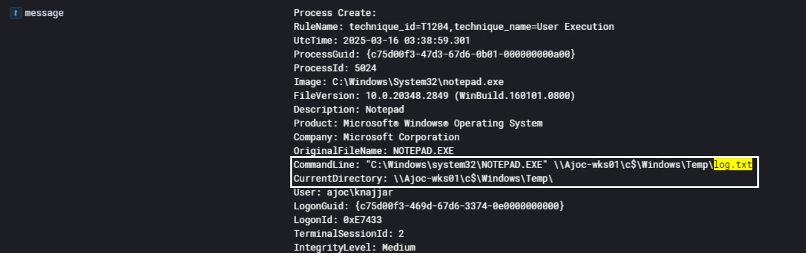

And in the next log after, there was mention of a network share object from 10.97.2.5, the IP address of AJOC-DC01. Under the knajjar username, these details were visible:

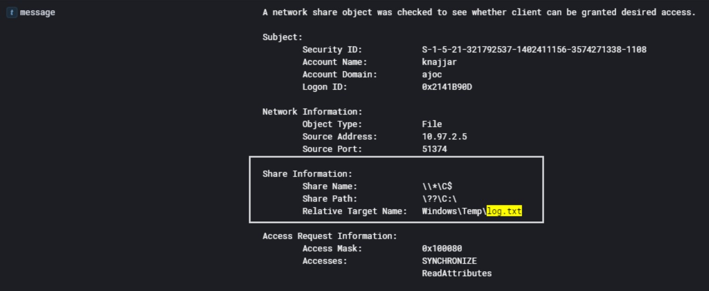

While the idea of understanding network share objects and its related logs are still shaky for my perception, the next thing to try to do was to see if a Temp folder did indeed exist under the 'knajjar' username inside AJOC-DC01. While not a full on match, there was a '%2Etemp' folder sitting in the Documents folder of knajjar inside AJOC-DC01. 

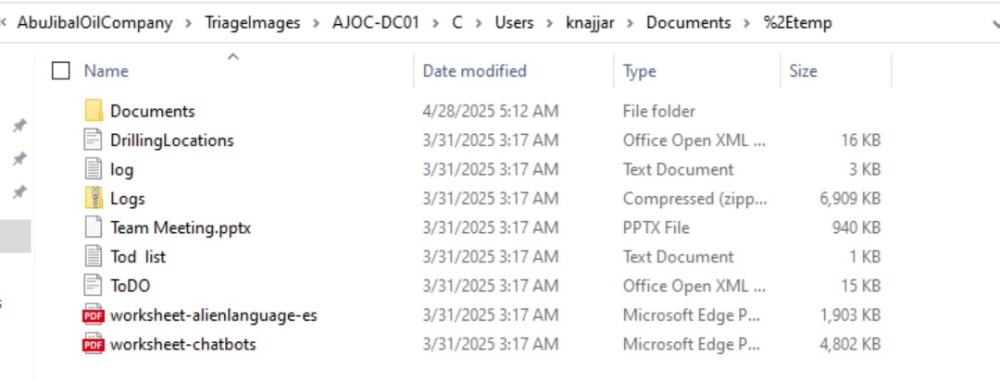

There is a prepared archive, called `Logs.zip`, and when briefly looking into it, there are the same file artifacts from the parent folder, `.temp` in it. 

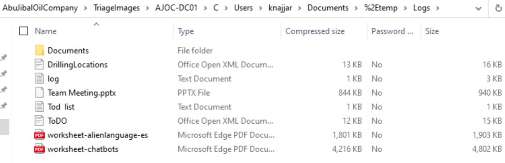

That's why, with a high confidence, it is possible to establish that `Logs.zip` in this `.temp` folder in AJOC-DC01 is what the TA prepared to exfiltrate out. 

*~~ And that concludes this Abu Jibal Oil Co. Lab!*

